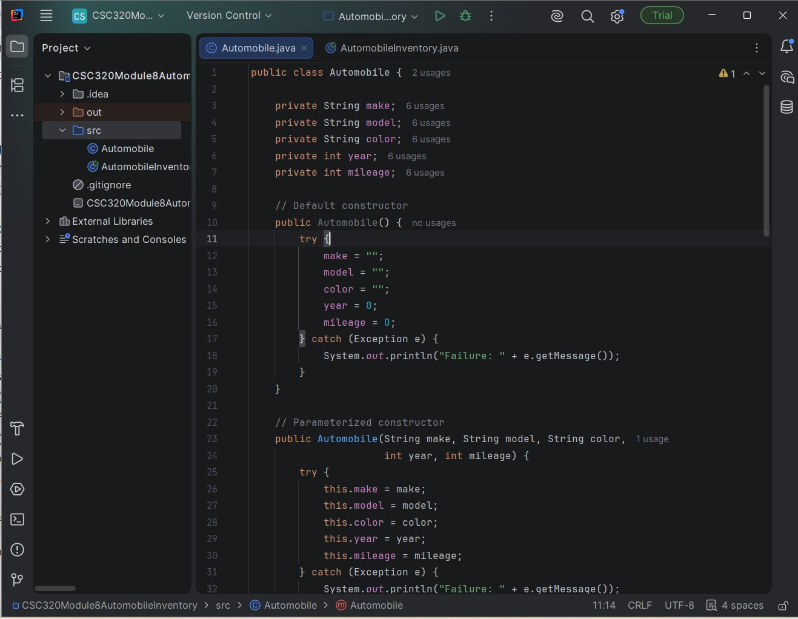
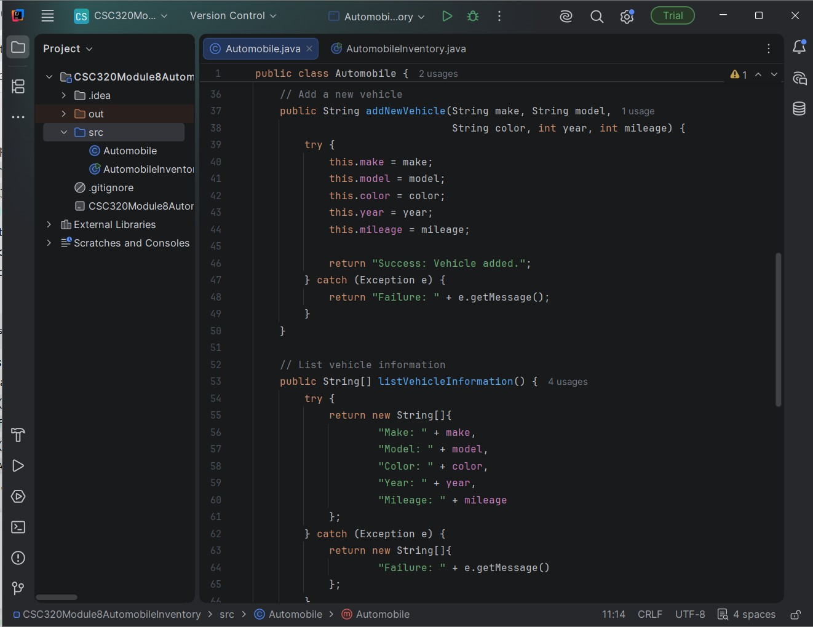
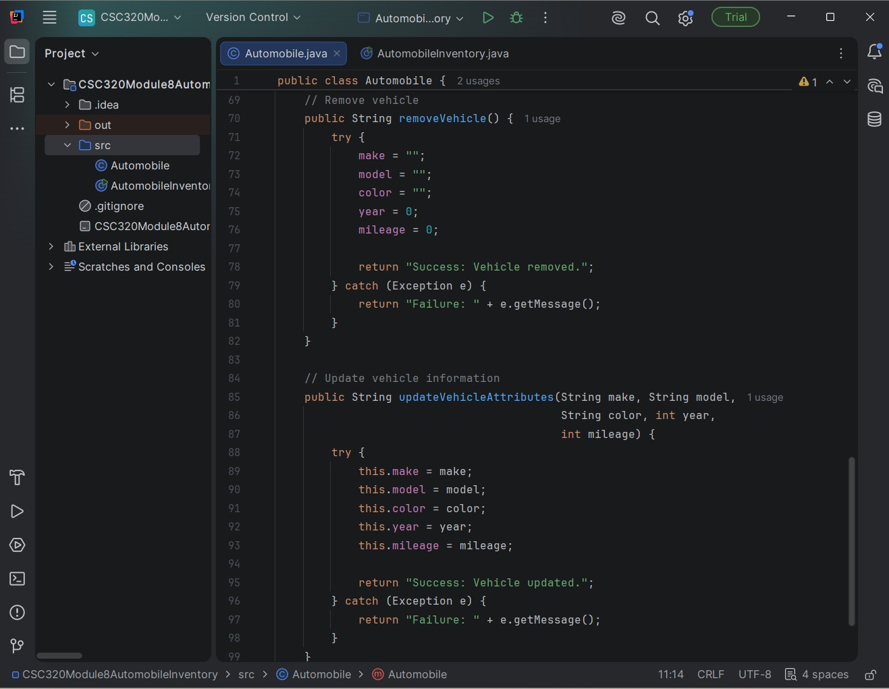
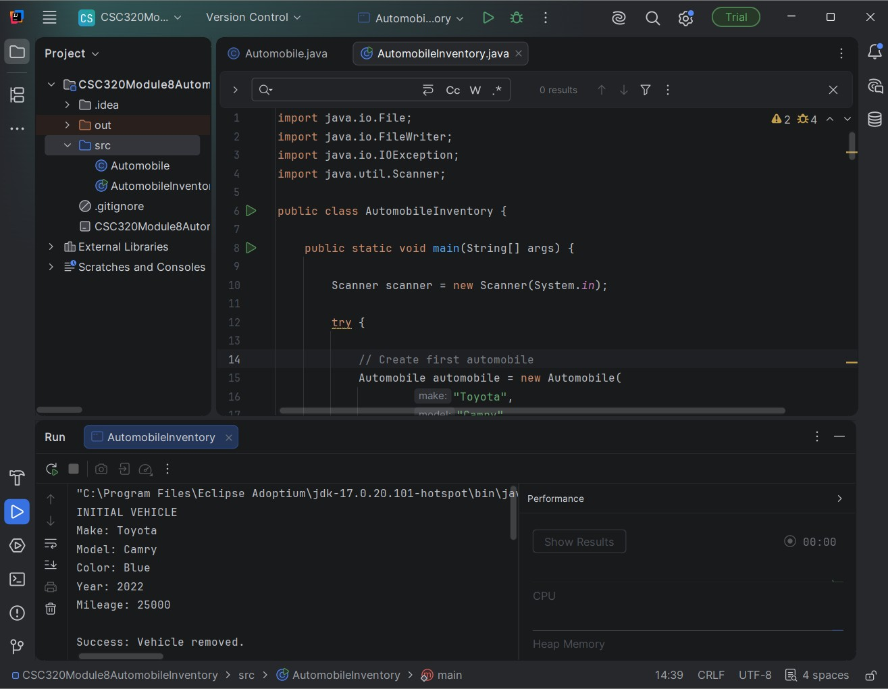
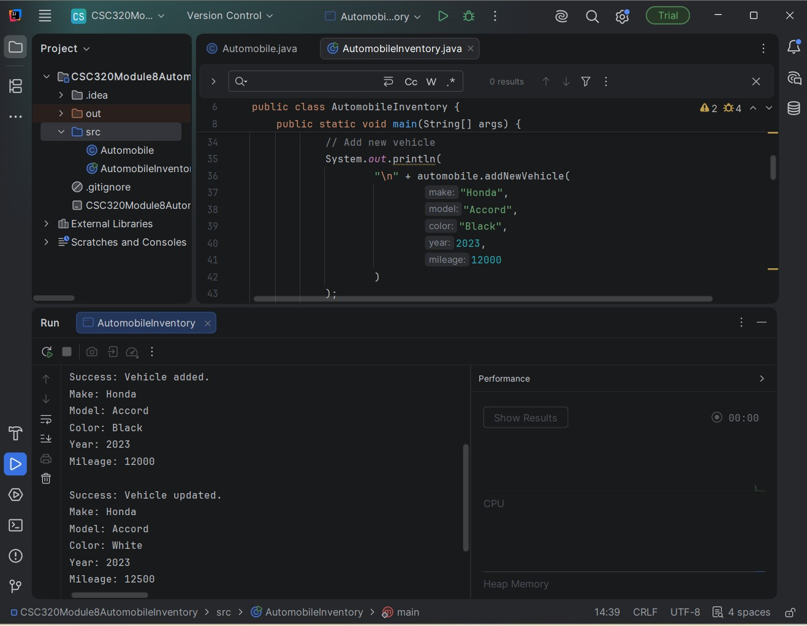
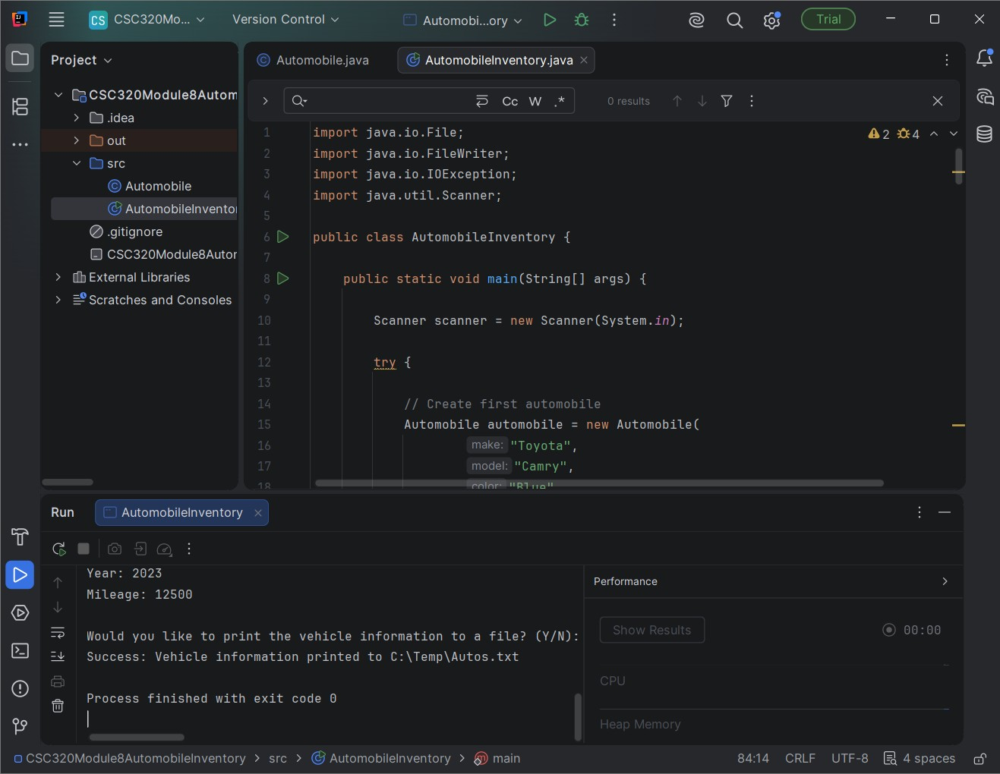
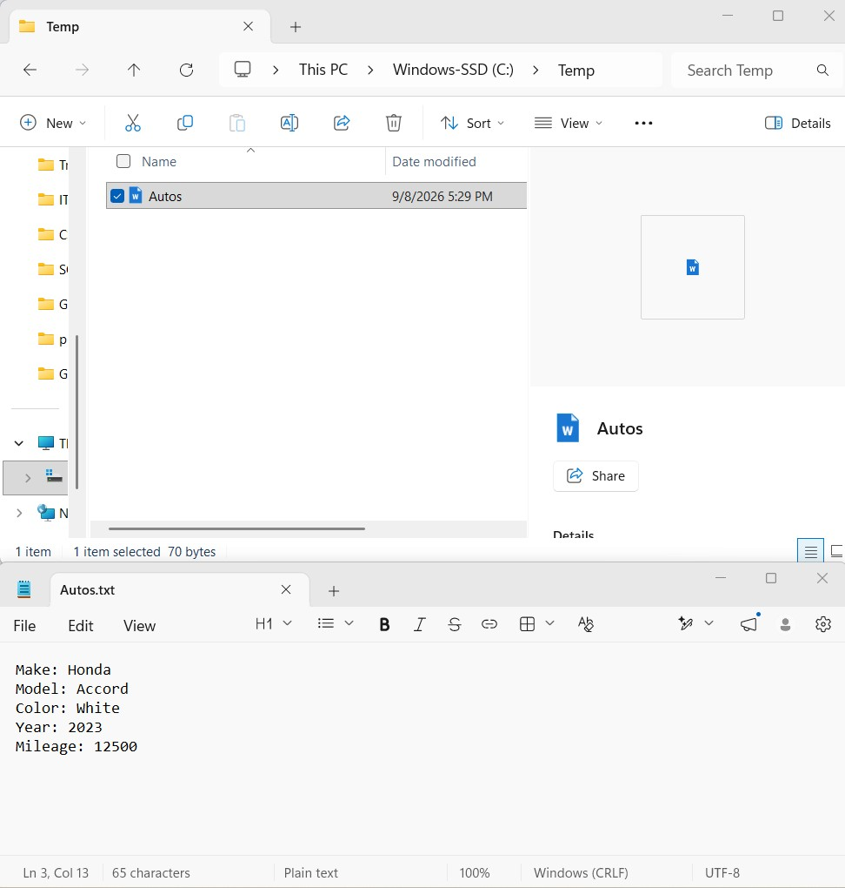

# CSC320 Module 8 - Automobile Inventory Program

## Course

CSC320 - Programming I

## Project Overview

This project is a Java automobile inventory program created for a car dealership. The purpose of the project is to demonstrate object-oriented programming concepts using classes, objects, constructors, methods, arrays, exception handling, user input, and file output.

## Automobile Class

The `Automobile` class contains the following private attributes:

- Make
- Model
- Color
- Year
- Mileage

The class also includes a default constructor and a parameterized constructor.

## Program Features

The program includes:

- Default constructor
- Parameterized constructor
- Add a new vehicle
- List vehicle information
- Remove a vehicle
- Update vehicle attributes
- `try...catch` exception handling
- String array output
- Scanner user input
- Console output
- File output

## Project Structure

```text
CSC320-Module8-Automobile-Inventory/
├── README.md
├── src/
│   ├── Automobile.java
│   └── AutomobileInventory.java
└── screenshots/
    ├── 01-automobile-class.jpg
    ├── 02a-automobile-methods-add-list.jpg
    ├── 02b-automobile-methods-remove-update.jpg
    ├── 03-initial-vehicle-output.jpg
    ├── 04-add-update-output.jpg
    ├── 05a-file-output.jpg
    ├── 05b-file-output.jpg
    └── 06-autos-file-verification.jpg
```

## Program Execution

The program first creates a Toyota Camry using the parameterized constructor.

It then performs the following actions:

1. Displays the initial vehicle information.
2. Removes the original vehicle information.
3. Adds a Honda Accord.
4. Displays the new vehicle information.
5. Updates the Honda Accord.
6. Displays the updated information.
7. Asks the user whether the vehicle information should be written to a file.
8. Writes the vehicle information to `C:\Temp\Autos.txt` when the user selects `Y`.

## Screenshots

### Automobile Class and Constructors



### Add and List Vehicle Methods



### Remove and Update Vehicle Methods



### Initial Vehicle Output



### Vehicle Add and Update Output



### File Output




### Autos.txt Verification



## Technologies Used

- Java
- IntelliJ IDEA
- JDK 17
- GitHub
- Windows

## What I Learned

This project helped me understand how Java classes can be used as blueprints for real-world objects. I practiced creating objects with constructors, managing object data with methods, using arrays, handling exceptions with `try...catch`, receiving user input with `Scanner`, and writing program information to a text file.

I also learned how object-oriented programming can make a program easier to organize and maintain.

## Author

Noki Shohid
